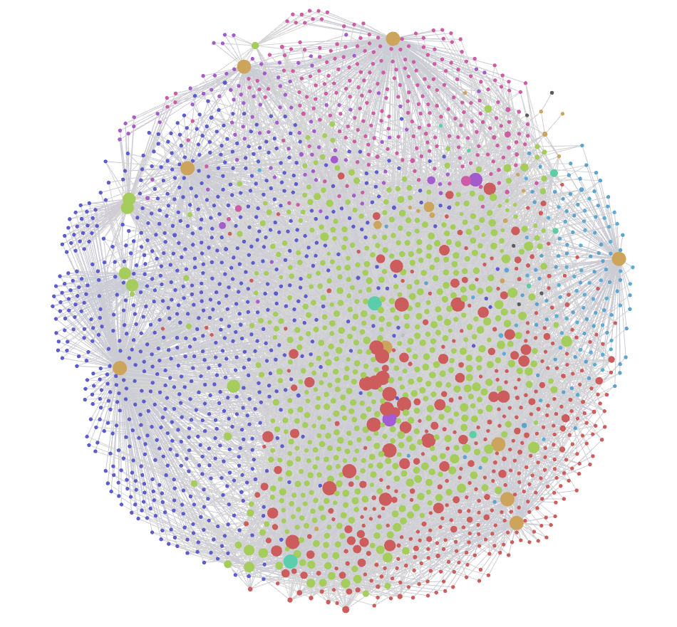

# README



| | |
| --- | --- |
| preview-url | https://abc202306.github.io/quartz/ |
| source-url | https://github.com/abc202306/galleries/ |

> [!Note]
> 1. [[#pinned|#pinned]]
> 1. [[#Web Clipper|#Web Clipper]]
> 1. [[#Folder Struct|#Folder Struct]]
> 1. [[#Views of gallery-base.base|#Views of gallery-base.base]]
> 1. [[#symbols|#symbols]]
> 1. [[#How to Use|#How to Use]]
> 1. [[#Script|#Script]]

## pinned

- [[collection-gallery-items]]
- [[gallery-doc-gallery-tag]]
- [[collection-gallery-notes]]

## Web Clipper

- EXHentai Web Clipper for Obsidian | https://github.com/abc202306/exhentai-web-clipper-for-obsidian
- NHentai Web Clipper for Obsidian | https://github.com/abc202306/nhentai-web-clipper-for-obsidian

## Folder Struct

> DFC stands for the total number of descendant files

| Folder Path | DFC | DFMC | DFOC |
| :--- | ---: | ---: | ---: |
| [[gallery-doc-exhentai-uploader\|exhentai-uploader]] | 170 | 170 | 0 |
| [[gallery-doc-galleries\|galleries]] | 1420 | 710 | 710 |
| [[gallery-doc-galleries\|galleries]]/[[gallery-url-exhentai\|exhentai]] | 606 | 303 | 303 |
| [[gallery-doc-galleries\|galleries]]/[[gallery-url-exhentai\|exhentai]]/[[gallery-year-2012\|2012]] | 2 | 1 | 1 |
| [[gallery-doc-galleries\|galleries]]/[[gallery-url-exhentai\|exhentai]]/[[gallery-year-2014\|2014]] | 2 | 1 | 1 |
| [[gallery-doc-galleries\|galleries]]/[[gallery-url-exhentai\|exhentai]]/[[gallery-year-2015\|2015]] | 4 | 2 | 2 |
| [[gallery-doc-galleries\|galleries]]/[[gallery-url-exhentai\|exhentai]]/[[gallery-year-2016\|2016]] | 6 | 3 | 3 |
| [[gallery-doc-galleries\|galleries]]/[[gallery-url-exhentai\|exhentai]]/[[gallery-year-2017\|2017]] | 16 | 8 | 8 |
| [[gallery-doc-galleries\|galleries]]/[[gallery-url-exhentai\|exhentai]]/[[gallery-year-2018\|2018]] | 14 | 7 | 7 |
| [[gallery-doc-galleries\|galleries]]/[[gallery-url-exhentai\|exhentai]]/[[gallery-year-2019\|2019]] | 12 | 6 | 6 |
| [[gallery-doc-galleries\|galleries]]/[[gallery-url-exhentai\|exhentai]]/[[gallery-year-2020\|2020]] | 16 | 8 | 8 |
| [[gallery-doc-galleries\|galleries]]/[[gallery-url-exhentai\|exhentai]]/[[gallery-year-2021\|2021]] | 18 | 9 | 9 |
| [[gallery-doc-galleries\|galleries]]/[[gallery-url-exhentai\|exhentai]]/[[gallery-year-2022\|2022]] | 26 | 13 | 13 |
| [[gallery-doc-galleries\|galleries]]/[[gallery-url-exhentai\|exhentai]]/[[gallery-year-2023\|2023]] | 40 | 20 | 20 |
| [[gallery-doc-galleries\|galleries]]/[[gallery-url-exhentai\|exhentai]]/[[gallery-year-2024\|2024]] | 100 | 50 | 50 |
| [[gallery-doc-galleries\|galleries]]/[[gallery-url-exhentai\|exhentai]]/[[gallery-year-2025\|2025]] | 334 | 167 | 167 |
| [[gallery-doc-galleries\|galleries]]/[[gallery-url-exhentai\|exhentai]]/[[gallery-year-2026\|2026]] | 16 | 8 | 8 |
| [[gallery-doc-galleries\|galleries]]/[[gallery-url-nhentai\|nhentai]] | 814 | 407 | 407 |
| [[gallery-doc-galleries\|galleries]]/[[gallery-url-nhentai\|nhentai]]/[[gallery-year-2014\|2014]] | 26 | 13 | 13 |
| [[gallery-doc-galleries\|galleries]]/[[gallery-url-nhentai\|nhentai]]/[[gallery-year-2015\|2015]] | 18 | 9 | 9 |
| [[gallery-doc-galleries\|galleries]]/[[gallery-url-nhentai\|nhentai]]/[[gallery-year-2016\|2016]] | 18 | 9 | 9 |
| [[gallery-doc-galleries\|galleries]]/[[gallery-url-nhentai\|nhentai]]/[[gallery-year-2017\|2017]] | 24 | 12 | 12 |
| [[gallery-doc-galleries\|galleries]]/[[gallery-url-nhentai\|nhentai]]/[[gallery-year-2018\|2018]] | 42 | 21 | 21 |
| [[gallery-doc-galleries\|galleries]]/[[gallery-url-nhentai\|nhentai]]/[[gallery-year-2019\|2019]] | 28 | 14 | 14 |
| [[gallery-doc-galleries\|galleries]]/[[gallery-url-nhentai\|nhentai]]/[[gallery-year-2020\|2020]] | 46 | 23 | 23 |
| [[gallery-doc-galleries\|galleries]]/[[gallery-url-nhentai\|nhentai]]/[[gallery-year-2021\|2021]] | 38 | 19 | 19 |
| [[gallery-doc-galleries\|galleries]]/[[gallery-url-nhentai\|nhentai]]/[[gallery-year-2022\|2022]] | 58 | 29 | 29 |
| [[gallery-doc-galleries\|galleries]]/[[gallery-url-nhentai\|nhentai]]/[[gallery-year-2023\|2023]] | 76 | 38 | 38 |
| [[gallery-doc-galleries\|galleries]]/[[gallery-url-nhentai\|nhentai]]/[[gallery-year-2024\|2024]] | 166 | 83 | 83 |
| [[gallery-doc-galleries\|galleries]]/[[gallery-url-nhentai\|nhentai]]/[[gallery-year-2025\|2025]] | 274 | 137 | 137 |
| [[gallery-doc-galleries\|galleries]]/[[gallery-url-nhentai\|nhentai]]/[[gallery-year-2026\|2026]] | 0 | 0 | 0 |
| [[gallery-doc\|gallery-doc]] | 63 | 57 | 6 |
| [[gallery-doc-property\|gallery-doc-property]] | 33 | 33 | 0 |
| [[gallery-doc-property\|gallery-doc-property]]/[[propertyns-gallery-basic\|propertyns-gallery-basic]] | 8 | 8 | 0 |
| [[gallery-doc-property\|gallery-doc-property]]/[[propertyns-gallery-docs\|propertyns-gallery-docs]] | 1 | 1 | 0 |
| [[gallery-doc-property\|gallery-doc-property]]/[[propertyns-gallery-item\|propertyns-gallery-item]] | 23 | 23 | 0 |
| [[gallery-doc-property\|gallery-doc-property]]/[[propertyns-gallery-notes\|propertyns-gallery-notes]] | 1 | 1 | 0 |
| [[gallery-doc-templates\|gallery-doc-templates]] | 3 | 3 | 0 |
| [[gallery-doc\|gallery-doc]]/[[collection\|collection]] | 2 | 2 | 0 |
| [[gallery-doc\|gallery-doc]]/[[gallery-doc\|gallery-doc]] | 13 | 13 | 0 |
| [[gallery-doc\|gallery-doc]]/[[gallery-doc-base-file\|gallery-doc-base-file]] | 4 | 0 | 4 |
| [[gallery-doc\|gallery-doc]]/[[gallery-doc-canvas\|gallery-doc-canvas]] | 1 | 0 | 1 |
| [[gallery-doc\|gallery-doc]]/[[gallery-doc-galleries\|gallery-doc-galleries]] | 2 | 2 | 0 |
| [[gallery-doc\|gallery-doc]]/[[gallery-doc-gallery-tag\|gallery-doc-gallery-tag]] | 14 | 14 | 0 |
| [[gallery-doc\|gallery-doc]]/[[gallery-doc-image-file\|gallery-doc-image-file]] | 1 | 0 | 1 |
| [[gallery-doc\|gallery-doc]]/[[gallery-doc-notation\|gallery-doc-notation]] | 1 | 1 | 0 |
| [[gallery-doc\|gallery-doc]]/[[gallery-doc-property\|gallery-doc-property]] | 4 | 4 | 0 |
| [[gallery-doc\|gallery-doc]]/[[gallery-doc-special-keywords\|gallery-doc-special-keywords]] | 7 | 7 | 0 |
| [[gallery-doc\|gallery-doc]]/[[gallery-doc-year\|gallery-doc-year]] | 14 | 14 | 0 |
| [[collection-gallery-notes\|gallery-notes]] | 9 | 6 | 3 |
| [[gallery-doc-gallery-tag\|gallery-tag]] | 1626 | 1626 | 0 |
| [[gallery-doc-gallery-tag\|gallery-tag]]/[[exhentai-tg-artist\|exhentai-tg-artist]] | 542 | 542 | 0 |
| [[gallery-doc-gallery-tag\|gallery-tag]]/[[exhentai-tg-categories\|exhentai-tg-categories]] | 10 | 10 | 0 |
| [[gallery-doc-gallery-tag\|gallery-tag]]/[[exhentai-tg-character\|exhentai-tg-character]] | 276 | 276 | 0 |
| [[gallery-doc-gallery-tag\|gallery-tag]]/[[exhentai-tg-cosplayer\|exhentai-tg-cosplayer]] | 1 | 1 | 0 |
| [[gallery-doc-gallery-tag\|gallery-tag]]/[[exhentai-tg-female\|exhentai-tg-female]] | 252 | 252 | 0 |
| [[gallery-doc-gallery-tag\|gallery-tag]]/[[exhentai-tg-group\|exhentai-tg-group]] | 256 | 256 | 0 |
| [[gallery-doc-gallery-tag\|gallery-tag]]/[[exhentai-tg-language\|exhentai-tg-language]] | 9 | 9 | 0 |
| [[gallery-doc-gallery-tag\|gallery-tag]]/[[exhentai-tg-location\|exhentai-tg-location]] | 4 | 4 | 0 |
| [[gallery-doc-gallery-tag\|gallery-tag]]/[[exhentai-tg-male\|exhentai-tg-male]] | 54 | 54 | 0 |
| [[gallery-doc-gallery-tag\|gallery-tag]]/[[exhentai-tg-mixed\|exhentai-tg-mixed]] | 7 | 7 | 0 |
| [[gallery-doc-gallery-tag\|gallery-tag]]/[[exhentai-tg-other\|exhentai-tg-other]] | 33 | 33 | 0 |
| [[gallery-doc-gallery-tag\|gallery-tag]]/[[exhentai-tg-parody\|exhentai-tg-parody]] | 107 | 107 | 0 |
| [[gallery-doc-gallery-tag\|gallery-tag]]/[[exhentai-tg-temp\|exhentai-tg-temp]] | 1 | 1 | 0 |
| [[gallery-doc-gallery-tag\|gallery-tag]]/[[nhentai-tg-keywords\|nhentai-tg-keywords]] | 74 | 74 | 0 |

## Views of [[base-gallery.base\|gallery-base.base]]

> [!Note]
> 
> 1. [[#artist|#artist]]
> 2. [[#categories|#categories]]
> 3. [[#parody|#parody]]
> 4. [[#female|#female]]
> 5. [[#male|#male]]
> 6. [[#mixed|#mixed]]
> 7. [[#character|#character]]

### artist

> seealso: [[base-gallery.base#artist|artist]]

1. [[base-gallery.base#artist/kiira|base-gallery.base]] | 5 | [[exhentai-tag-kiira|kiira]]
2. [[base-gallery.base#artist/henreader|base-gallery.base]] | 5 | [[exhentai-tag-henreader|henreader]]
3. [[base-gallery.base#artist/utatane|base-gallery.base]] | 4 | [[exhentai-tag-utatane|utatane]]
4. [[base-gallery.base#artist/wancho|base-gallery.base]] | 5 | [[exhentai-tag-wancho|wancho]]
5. [[base-gallery.base#artist/custom-udon|base-gallery.base]] | 3 | [[exhentai-tag-custom-udon|custom-udon]]
6. [[base-gallery.base#artist/komugi|base-gallery.base]] | 3 | [[exhentai-tag-komugi|komugi]]
7. [[base-gallery.base#artist/hikami-izuto|base-gallery.base]] | 2 | [[exhentai-tag-hikami-izuto|hikami-izuto]]
8. [[base-gallery.base#artist/murai-renji|base-gallery.base]] | 1 | [[exhentai-tag-murai-renji|murai-renji]]
9. [[base-gallery.base#artist/yoyomax|base-gallery.base]] | 1 | [[exhentai-tag-yoyomax|yoyomax]]
10. [[base-gallery.base#artist/kani-biimu|base-gallery.base]] | 1 | [[exhentai-tag-kani-biimu|kani-biimu]]
11. [[base-gallery.base#artist/baku-p|base-gallery.base]] | 1 | [[exhentai-tag-baku-p|baku-p]]

### categories

> seealso: [[base-gallery.base#categories|categories]]

1. [[base-gallery.base#categories/doujinshi|base-gallery.base]] | 463 | [[exhentai-tag-doujinshi|doujinshi]]
2. [[base-gallery.base#categories/manga|base-gallery.base]] | 114 | [[exhentai-tag-manga|manga]]
3. [[base-gallery.base#categories/image-set|base-gallery.base]] | 37 | [[exhentai-tag-image-set|image-set]]
4. [[base-gallery.base#categories/misc|base-gallery.base]] | 23 | [[exhentai-tag-misc|misc]]
5. [[base-gallery.base#categories/artist-cg|base-gallery.base]] | 33 | [[exhentai-tag-artist-cg|artist-cg]]
6. [[base-gallery.base#categories/game-cg|base-gallery.base]] | 8 | [[exhentai-tag-game-cg|game-cg]]
7. [[base-gallery.base#categories/non-h|base-gallery.base]] | 4 | [[exhentai-tag-non-h|non-h]]
8. [[base-gallery.base#categories/western|base-gallery.base]] | 1 | [[exhentai-tag-western|western]]

### parody

> seealso: [[base-gallery.base#parody|parody]]

1. [[base-gallery.base#parody/original|base-gallery.base]] | 193 | [[exhentai-tag-original|original]]
2. [[base-gallery.base#parody/blue-archive|base-gallery.base]] | 93 | [[exhentai-tag-blue-archive|blue-archive]]
3. [[base-gallery.base#parody/touhou-project|base-gallery.base]] | 25 | [[exhentai-tag-touhou-project|touhou-project]]
4. [[base-gallery.base#parody/mahoujin-guru-guru|base-gallery.base]] | 20 | [[exhentai-tag-mahoujin-guru-guru|mahoujin-guru-guru]]

### female

1. [[base-gallery.base#female/lolicon|base-gallery.base]] | 644 | [[exhentai-tag-lolicon|lolicon]]
2. [[base-gallery.base#female/rape|base-gallery.base]] | 106 | [[exhentai-tag-rape|rape]]

### male

1. [[base-gallery.base#male/sole-male|base-gallery.base]] | 293 | [[exhentai-tag-sole-male|sole-male]]

### mixed

1. [[base-gallery.base#mixed/kodomo-doushi|base-gallery.base]] | 27 | [[exhentai-tag-kodomo-doushi|kodomo-doushi]]

### character

1. [[base-gallery.base#character/kukuri|base-gallery.base]] | 19 | [[exhentai-tag-kukuri|kukuri]]

## symbols

> [!Note]
> - symbol-type
> 	- REGEXP-PREFIX | [[tag-regexp-prefix|regexp-prefix]]
> 	- REGEXP-NONE | [[tag-regexp-none|regexp-none]]
> 	- FILE | [[tag-file|file]]
> - symbol-tag
> 	- GROUPED | [[tag-grouped|grouped]]


| FOLDER                                       | FILE                                                                                                                             | SYMBOL-TYPE | SYMBOL-TAG |
| -------------------------------------------- | -------------------------------------------------------------------------------------------------------------------------------- | ----------- | ---------- |
| `/`                                          | `"README.md"`                                                                                                                    | [[tag-file\|file]]       |            |
| `/exhentai-uploader/`                        | `/^exhentai-uploader-(?<uploaderName>.+)\.md/`                                                                                   | [[tag-regexp-prefix\|regexp-prefix]]     |            |
| `/galleries/exhentai/`                       | `/^(?<yearUploaded>\d{4})\/exhentai-g-(?<exhentaiGalleryID>\d+)-(?<exhentaiGalleryToken>.+)\.(?<extension>md\|png\|jpg\|webp)$/` | [[tag-regexp-prefix\|regexp-prefix]]     | [[tag-grouped\|grouped]]  |
| `/galleries/nhentai/`                        | `/^(?<yearUploaded>\d{4})\/nehentai-g-(?<nhentaiGalleryID>\d+)\.(?<extension>md\|png\|jpg\|webp)$/`                              | [[tag-regexp-prefix\|regexp-prefix]]     | [[tag-grouped\|grouped]]  |
| `/gallery-doc-property/`                     | `/^(?<propertyNameSpaceName>.+)\/property-(?<propertyName>.+)\.md$/`                                                             | [[tag-regexp-prefix\|regexp-prefix]]     | [[tag-grouped\|grouped]]  |
| `/gallery-doc-templates/`                    | `/^template-(?<templateName>.+)\.md$/`                                                                                           | [[tag-regexp-prefix\|regexp-prefix]]     |            |
| `/gallery-doc/collection/`                   | `/^collection-(?<collectionName>gallery-.+)\.md$/`                                                                               | [[tag-regexp-prefix\|regexp-prefix]]     |            |
| `/gallery-doc/gallery-doc-base-file/`        | `/^base-(?<baseItemName>.+)\.base$/`                                                                                             | [[tag-regexp-prefix\|regexp-prefix]]     |            |
| `/gallery-doc/gallery-doc-canvas/`           | `/^canvas-(?<canvasName>.+)\.canvas$/`                                                                                           | [[tag-regexp-prefix\|regexp-prefix]]     |            |
| `/gallery-doc/gallery-doc-galleries/`        | `/^gallery-url-(?<galleryUrlTypeName>.+)\.md$/`                                                                                  | [[tag-regexp-prefix\|regexp-prefix]]     |            |
| `/gallery-doc/gallery-doc-image-file/`       | `/^image-(?<imageName>.+)\.png$/`                                                                                                | [[tag-regexp-prefix\|regexp-prefix]]     |            |
| `/gallery-doc/gallery-doc-notation/`         | `/^notation-(?<notationName>.+)\.md$/`                                                                                           | [[tag-regexp-prefix\|regexp-prefix]]     |            |
| `/gallery-doc/gallery-doc-property/`         | `/^propertyns-(?<propertyNameSpaceName>.+)\.md$/`                                                                                | [[tag-regexp-prefix\|regexp-prefix]]     |            |
| `/gallery-doc/gallery-doc-special-keywords/` | `/^(?<fileBaseName>.+)\.md$/`                                                                                                    | [[tag-regexp-none\|regexp-none]]       |            |
| `/gallery-doc/gallery-doc-year/`             | `/^gallery-year-(?<year>\d{4})\.md$/`                                                                                            | [[tag-regexp-prefix\|regexp-prefix]]     |            |
| `/gallery-doc/gallery-doc/`                  | `/^gallery-doc-(?<galleryDocName>.+)\.md$/`                                                                                      | [[tag-regexp-prefix\|regexp-prefix]]     |            |
| `/gallery-doc/gallery-tag/`                  | `/^(ex\|n)hentai-tg-(?<tagNameSpaceName>.+)\.md$/`                                                                               | [[tag-regexp-prefix\|regexp-prefix]]     |            |
| `/gallery-notes/`                            | `/gallery-note-(?<date>\d{4}-\d{2}-\d{2})\s(?<noteTitle>.*)^\.md$/`                                                              | [[tag-regexp-prefix\|regexp-prefix]]     |            |
| `/gallery-notes/`                            | `"base-galley-note.base"`                                                                                                        | [[tag-file\|file]]       |            |
| `/gallery-tag/`                              | `/^(ex\|n)hentai-tg-(?<tagNameSpaceName>.+)\/exhentai-tag-(?<exhentaiTagName>.+)\.md$/`                                          | [[tag-regexp-prefix\|regexp-prefix]]     | [[tag-grouped\|grouped]]  |

## How to Use

1. requirements
	1. Obsidian (software)
	1. Git (Software)
	1. Git LFS (Git Extension)

```powershell
mkdir "./galleries/"
cd "./galleries/"
git clone "https://github.com/abc202306/galleries/"
git lfs pull
```

## Script

### Build Index Content

```js

class FolderConfig { // all folder type is type/rewrite
	tag = "gallery-tag/";
	gallery = "galleries/";
	property = "gallery-doc-property/";
	uploader = "exhentai-uploader/";
	docsTag = "gallery-doc/gallery-doc-gallery-tag/";
	docsYear = "gallery-doc/gallery-doc-year/";

	static _typeDict = {
		rewrite: ["tag", "gallery", "property", "uploader", "docsTag", "docsYear"]
	}
}

class FileConfig {
	readme = "README.md"; //type/replace
	tag = "gallery-doc/gallery-doc/gallery-doc-gallery-tag.md"; //type/rewrite
	uploader = "gallery-doc/gallery-doc/gallery-doc-exhentai-uploader.md"; //type/rewrite
	galleryNotes = "gallery-doc/collection/collection-gallery-notes.md"; //type/replace
	gallery = "gallery-doc/collection/collection-gallery-items.md"; //type/replace
	exhentai = "gallery-doc/gallery-doc-galleries/gallery-url-exhentai.md"; //type/replace
	nhentai = "gallery-doc/gallery-doc-galleries/gallery-url-nhentai.md"; //type/replace
	
	static _typeDict = {
		replace: ["readme", "galleryNotes", "gallery", "exhentai", "nhentai"],
		rewrite: ["tag", "uploader"]
	}
}

class RefConfig {
	// docs
	docsMeta = "[[gallery-doc|gallery-doc]]";
	docsTag = "[[gallery-doc-gallery-tag|gallery-doc-gallery-tag]]";
	docsCollection = "[[collection|collection]]";

	// base
	baseGalleryDynamic = "[[base-gallery-dynamic.base|base-gallery-dynamic.base]]";
	basePropertyDynamic = "[[base-property-dynamic.base|base-property-dynamic.base]]";
	baseGallery = "[[base-gallery.base|base-gallery.base]]";
	
	// galleryTagGrouop
	galleryTagGroupArtist = "[[exhentai-tg-artist|artist]]";
	galleryTagGroupCategories = "[[exhentai-tg-categories|categories]]";
	galleryTagGroupCharacter = "[[exhentai-tg-character|character]]";
	galleryTagGroupCosplayer = "[[exhentai-tg-cosplayer|cosplayer]]";
	galleryTagGroupFemale = "[[exhentai-tg-female|female]]";
	galleryTagGroupGroup = "[[exhentai-tg-group|group]]";
	galleryTagGroupKeywords = "[[nhentai-tg-keywords|keywords]]";
	galleryTagGroupLanguage = "[[exhentai-tg-language|language]]";
	galleryTagGroupLocation = "[[exhentai-tg-location|location]]";
	galleryTagGroupMale = "[[exhentai-tg-male|male]]";
	galleryTagGroupMixed = "[[exhentai-tg-mixed|mixed]]";
	galleryTagGroupOther = "[[exhentai-tg-other|other]]";
	galleryTagGroupParody = "[[exhentai-tg-parody|parody]]";
	galleryTagGroupTemp = "[[exhentai-tg-temp|temp]]";

	// collection
	collectionGallery = "[[collection-gallery-items|collection-gallery-items]]";
	collectionGalleryNotes = "[[collection-gallery-notes|collection-gallery-notes]]";
}

class KeywordsConfig {
	exhentai = "exhentai";
	nhentai = "nhentai";
	galleryItems = "[[gallery-items|gallery-items]]";
	noteList = "note-list";
}

class PropertyConfig {
	propertyNames = [
        "artist",
        "group",
        "categories",
        "character",
        "parody",
        "language",
        "cosplayer",
        "female",
        "location",
        "male",
        "mixed",
        "other",
        "temp",
        "keywords",
        "uploader",
    ]
}

class Config {
	pathFolder = new FolderConfig();
	pathFile = new FileConfig();
    ref = new RefConfig();
    keywords = new KeywordsConfig();
	property = new PropertyConfig();
}

const config = new Config();

class DateUtil {
    static _singleInstance = new DateUtil();

    static getSingleInstance() {
        return DateUtil._singleInstance;
    }

    getLocalISOStringWithTimezone() {
        const date = new Date();
        const pad = (n) => String(n).padStart(2, "0");

        const offset = -date.getTimezoneOffset();
        const sign = offset >= 0 ? "+" : "-";
        const hours = pad(Math.floor(Math.abs(offset) / 60));
        const minutes = pad(Math.abs(offset) % 60);

        return (
            `${date.getFullYear()}-${pad(date.getMonth() + 1)}-${pad(date.getDate())}T` +
            `${pad(date.getHours())}:${pad(date.getMinutes())}:${pad(date.getSeconds())}` +
            `${sign}${hours}:${minutes}`
        );
    }
}

class ArrayUtil {
    static _singleInstance = new ArrayUtil();

    static getSingleInstance() {
        return ArrayUtil._singleInstance;
    }
    // Utility helpers to avoid relying on environment-specific prototype extensions
    uniqueArray(arr) {
        return Array.from(new Set(arr));
    }

    groupBy(array, keyFn) {
        const map = new Map();
        for (const item of array) {
            const key = keyFn(item);
            const list = map.get(key) || [];
            list.push(item);
            map.set(key, list);
        }
        return Array.from(map.entries());
    }

    safeArray(v) {
        if (!v) return [];
        return Array.isArray(v) ? v : [v];
    }
}

class PathUtil {
    static _singleInstance = new PathUtil();

    static getSingleInstance() {
        return PathUtil._singleInstance;
    }

    compareGalleryPathWithPropertyUploaded(path1, path2) {
        const f1 = app.vault.getAbstractFileByPath(path1);
        const f2 = app.vault.getAbstractFileByPath(path2);
        const fc1 = app.metadataCache.getFileCache(f1);
        const fc2 = app.metadataCache.getFileCache(f2);
        const v1 = String(fc1?.frontmatter?.uploaded || "_");
        const v2 = String(fc2?.frontmatter?.uploaded || "_");
        // sort descending
        const result = v2.localeCompare(v1);
        if (result !== 0) {
            return result;
        }
        return path2.localeCompare(path1);
    }

    getGalleryPathRepresentationStr(path) {
        const f2 = app.vault.getAbstractFileByPath(path);
        const linktext2 = app.metadataCache.fileToLinktext(f2);
        const fc2 = app.metadataCache.getFileCache(f2) || {};

        const postDescription = "";

        const display2 = fc2.frontmatter?.japanese || fc2.frontmatter?.english || linktext2;
        const link2 =
            display2 === linktext2
                ? `| [[${linktext2}|${linktext2}]]`
                : `\u001C${display2}\u001C | [[${linktext2}|${linktext2}]]`.replace(/\u001C/g, "`");

        const coverField = fc2.frontmatter?.cover;
        let coverEmbed = "";
        if (coverField) {
            const res = /^\[\[(?<linktext3>[^\|]*)\|?.*\]\]$/.exec(coverField);
            coverEmbed = res
                ? `\n\t- ![[${res.groups.linktext3}|200]]`
                : `\n\t- `;
        }

        return `1. ${link2}${postDescription}${coverEmbed}`;
    }

    getNGStr(nonGalleryNotePaths) {
        const ngls = [...nonGalleryNotePaths].sort();
        return ngls
            .map((path) => `[[${app.metadataCache.fileToLinktext(app.vault.getAbstractFileByPath(path))}|${app.metadataCache.fileToLinktext(app.vault.getAbstractFileByPath(path))}]]`)
            .join(", ");
    }

    getGStrASList(galleryNotePaths) {
        const gls = [...galleryNotePaths].sort(pathUtil.compareGalleryPathWithPropertyUploaded);
        return gls.map(pathUtil.getGalleryPathRepresentationStr).join("\n");
    }

    getGStrASGroupedList(galleryNotePaths) {
        const gls = [...galleryNotePaths].sort(pathUtil.compareGalleryPathWithPropertyUploaded);
        const groupedByYear = arrayUtil.groupBy(gls, (gnPath) => stringUtil.getYear(app.vault.getAbstractFileByPath(gnPath)));
        const parts = groupedByYear
            .sort((a, b) => b[0].localeCompare(a[0]))
            .flatMap(([yearKey, yearGroup]) => {
                const groupedByMonth = arrayUtil.groupBy(yearGroup, (gnPath) => stringUtil.getMonth(app.vault.getAbstractFileByPath(gnPath)));
                const yearSectionContentParts = groupedByMonth
                    .sort((a, b) => b[0].localeCompare(a[0]))
                    .flatMap(([monthKey, monthGroup]) => {
						const groupedByDay = arrayUtil.groupBy(monthGroup, (gnPath) => stringUtil.getDay(app.vault.getAbstractFileByPath(gnPath)));
						const daySectionContentParts = groupedByDay
							.sort((a, b) => b[0].localeCompare(a[0]))
							.flatMap(([dayKey, dayGroup]) => [
								`##### ${dayKey}`,
								dayGroup.map(pathUtil.getGalleryPathRepresentationStr).join("\n")
							]);
						return [
	                        `#### ${monthKey}`,
	                        ...daySectionContentParts
	                    ]					
					});
                return [
                    `### ${yearKey}`,
                    ...yearSectionContentParts
                ];
            });
        return parts.join("\n\n");
    }

    getGStr(galleryNotePaths) {
        return pathUtil.getGStrASGroupedList(galleryNotePaths);
    }
}

class FileTemplateUtil {
    static _singleInstance = new FileTemplateUtil();

    static getSingleInstance() {
        return FileTemplateUtil._singleInstance;
    }

    getTagFileContent(title, ctime, mtime, _seealso) {
        const f = app.metadataCache.getFirstLinkpathDest(title);
        const backlinks = app.metadataCache.getBacklinksForFile(f)?.data;
        const paths = backlinks ? [...backlinks.keys()] : [];

        const ngstr = pathUtil.getNGStr(
            paths.filter((i) => !i.startsWith(config.pathFolder.gallery)).filter((i) => i !== config.pathFile.readme)
        );
        const gstr = pathUtil.getGStr(paths.filter((i) => i.startsWith(config.pathFolder.gallery)));

        return `---\nctime: ${ctime}\nmtime: ${mtime}\n---\n\n# ${title}\n\n> seealso: ${ngstr}\n\n!${config.ref.baseGalleryDynamic}\n\n## ${config.keywords.galleryItems}\n\n${gstr}\n`;
    }

    getYearFileContent(title, ctime, mtime, _seealso) {
        const f = app.metadataCache.getFirstLinkpathDest(title);
        const backlinks = app.metadataCache.getBacklinksForFile(f)?.data;
        const paths = backlinks ? [...backlinks.keys()] : [];

        const ngstr = pathUtil.getNGStr(
            paths.filter((i) => !i.startsWith(config.pathFolder.gallery)).filter((i) => i !== config.pathFile.readme)
        );

        const year = title.replace(/^gallery-year-/, "");

        const galleryNotePaths = app
            .vault
            .getMarkdownFiles()
            .filter((f) => f.path.startsWith(config.pathFolder.gallery))
            .filter((f) => stringUtil.getYear(f) === year)
            .map((f) => f.path);
        const gstr = pathUtil.getGStr(galleryNotePaths);

        return `---\nctime: ${ctime}\nmtime: ${mtime}\n---\n\n# ${title}\n\n> seealso: ${ngstr}\n\n## ${config.keywords.galleryItems}\n\n${gstr}\n`;
    }

    getGroupFileContent(title, ctime, mtime, seealso) {
        return `---\nctime: ${ctime}\nmtime: ${mtime}\n---\n\n# ${title}\n\n> seealso: ${seealso}\n\n${fileTemplateUtil._getTagGroupMOC(title)}\n`;
    }

    getTagMetaFileContent(_title, ctime, mtime, _seealso) {
        const { 
			docs, 
			galleryTagGroupArtist, 
			galleryTagGroupCategories, 
			galleryTagGroupCharacter, 
			galleryTagGroupCosplayer, 
			galleryTagGroupFemale, 
			galleryTagGroupGroup, 
			galleryTagGroupKeywords, 
			galleryTagGroupLanguage, 
			galleryTagGroupLocation, 
			galleryTagGroupMale, 
			galleryTagGroupMixed, 
			galleryTagGroupOther, 
			galleryTagGroupParody, 
			galleryTagGroupTemp 
		} = config.ref;

		const ol = [
			galleryTagGroupArtist, 
			galleryTagGroupCategories, 
			galleryTagGroupCharacter, 
			galleryTagGroupCosplayer, 
			galleryTagGroupFemale, 
			galleryTagGroupGroup, 
			galleryTagGroupKeywords, 
			galleryTagGroupLanguage, 
			galleryTagGroupLocation, 
			galleryTagGroupMale, 
			galleryTagGroupMixed, 
			galleryTagGroupOther, 
			galleryTagGroupParody,
			galleryTagGroupTemp 
		].map((value)=>`1. ${value} | ${stringUtil.getTagCount(value)}\n`).join("");
		
        return `---\nctime: ${ctime}\nmtime: ${mtime}\n---\n\n# tag\n\n> seealso: ${docs}\n\n${ol}`;
    }

    getTagGroupFileContent(title, ctime, mtime, _seealso) {
        return fileTemplateUtil.getGroupFileContent(title, ctime, mtime, config.ref.docsTag);
    }

    getUploaderGroupFileContent(title, ctime, mtime, _seealso) {
        return fileTemplateUtil.getGroupFileContent(title, ctime, mtime, config.ref.docsMeta);
    }

    getPropertyFileContent(title, ctime, mtime, _seealso) {
        const f = app.metadataCache.getFirstLinkpathDest(title);
        const backlinks = app.metadataCache.getBacklinksForFile(f)?.data;
        const paths = backlinks ? [...backlinks.keys()] : [];

        const ngstr = pathUtil.getNGStr(
            paths.filter((i) => !i.startsWith(config.pathFolder.gallery)).filter((i) => i !== config.pathFile.readme)
        );

        return `---\nctime: ${ctime}\nmtime: ${mtime}\n---\n\n# ${title}\n\n> seealso: ${ngstr}\n\n!${config.ref.basePropertyDynamic}\n`;
    }

    async getReadmeFileContent(_title, ctime, mtime, _seealso) {
        const file = app.vault.getAbstractFileByPath(config.pathFile.readme);
        const fileContent = await app.vault.read(file);

        const files = app.vault.getFiles();
        const folders = app.vault.getAllFolders().sort((a, b) => a.path.localeCompare(b.path));

        const tableStr = `| Folder Path | DFC | DFMC | DFOC |\n| :--- | ---: | ---: | ---: |\n${folders
            .map((folder) => `| ${stringUtil.getRenderedFolderPath(folder)} | ${stringUtil.getDecendantFilesCount(folder, files, /.*/)} | ${stringUtil.getDecendantFilesCount(folder, files, /^md$/)} | ${stringUtil.getDecendantFilesCount(folder, files, /^(?!md$)/)} |`)
            .join("\n")}`;

        const newData = stringUtil.replaceFrontMatter(fileContent, ctime, mtime).replace(
            /(?<=\n)## Folder Struct\n[^#]*(?=\n##\s)/,
            "## Folder Struct\n\n> DFC stands for the total number of descendant files\n\n" + tableStr + "\n"
        );

        return newData;
    }

    async getNoteMetaFileContent(_title, ctime, mtime, _seealso) {
        const metaFilePath = config.pathFile.galleryNotes;
        const noteFiles = app
            .vault
            .getMarkdownFiles()
            .filter((f) => arrayUtil.safeArray(app.metadataCache.getFileCache(f)?.frontmatter?.up).includes(config.ref.collectionGalleryNotes));

        const file = app.vault.getAbstractFileByPath(metaFilePath);
        const fileContent = await app.vault.read(file);

        const gls = noteFiles
            .sort((f1, f2) => {
                const fc1 = app.metadataCache.getFileCache(f1) || {};
                const fc2 = app.metadataCache.getFileCache(f2) || {};
                const v1 = fc1.frontmatter?.ctime || "_";
                const v2 = fc2.frontmatter?.ctime || "_";
                return v2.localeCompare(v1);
            })
            .map((f) => f.path);

        const gstr = gls.map(pathUtil.getGalleryPathRepresentationStr).join("\n");

        const preFMBlock = `\nup:\n  - "${config.ref.docsCollection}"`;
        const newData = stringUtil.replaceFrontMatter(fileContent, ctime, mtime, preFMBlock).replace(new RegExp(`(?<=\n)## ${RegExp.escape(config.keywords.noteList)}\n[^]*`),
            `## ${config.keywords.noteList}\n\n${gstr}\n`
        );

        return newData;
    }

    async getSpecGalleryMetaFileContent(_title, ctime, mtime, _seealso) {
        const metaFilePath = config.pathFile.gallery;
        const galleryNoteFiles = app
            .vault
            .getMarkdownFiles()
            .filter((f) => arrayUtil.safeArray(app.metadataCache.getFileCache(f)?.frontmatter?.up).includes(config.ref.collectionGallery));
        const preFMBlock = `\nup:\n  - "${config.ref.docsCollection}"\nbases:\n  - "${config.ref.baseGallery}"`;
        return await fileTemplateUtil._getGalleryMetaFileContentWithSpecPath(_title, ctime, mtime, metaFilePath, galleryNoteFiles, preFMBlock);
    }

    async getSpecEXHentaiGalleryMetaFileContent(_title, ctime, mtime, _seealso) {
        const metaFilePath = config.pathFile.exhentai;
        const galleryNoteFiles = app
            .vault
            .getMarkdownFiles()
            .filter((f) => arrayUtil.safeArray(app.metadataCache.getFileCache(f)?.frontmatter?.up).includes(config.ref.collectionGallery))
            .filter((f) => (app.metadataCache.getFileCache(f)?.frontmatter?.url || "").includes(config.keywords.exhentai));
        return await fileTemplateUtil._getGalleryMetaFileContentWithSpecPath(_title, ctime, mtime, metaFilePath, galleryNoteFiles);
    }

    async getSpecNHentaiGalleryMetaFileContent(_title, ctime, mtime, _seealso) {
        const metaFilePath = config.pathFile.nhentai;
        const galleryNoteFiles = app
            .vault
            .getMarkdownFiles()
            .filter((f) => arrayUtil.safeArray(app.metadataCache.getFileCache(f)?.frontmatter?.up).includes(config.ref.collectionGallery))
            .filter((f) => (app.metadataCache.getFileCache(f)?.frontmatter?.url || "").includes(config.keywords.nhentai));
        return await fileTemplateUtil._getGalleryMetaFileContentWithSpecPath(_title, ctime, mtime, metaFilePath, galleryNoteFiles);
    }

    _getTagGroupMOC(title) {
        const property = title.replace(/^(gallery-doc-)?((ex|n)hentai-)?(tg-)?/, "");
        const galleryMDFileCaches = app
            .vault
            .getMarkdownFiles()
            .filter((f) => f.path.startsWith(config.pathFolder.gallery))
            .map((f) => app.metadataCache.getFileCache(f) || {});

        const allValues = galleryMDFileCaches.flatMap((fc) => arrayUtil.safeArray((fc.frontmatter || {})[property]));
        const uniqueValues = arrayUtil.uniqueArray(allValues).filter((v) => v);

        return uniqueValues
            .sort((a, b) => stringUtil.toFileName(a).localeCompare(stringUtil.toFileName(b)))
            .map((v) =>
                `1. ${v} | ${galleryMDFileCaches.filter((fc) => arrayUtil.safeArray((fc.frontmatter || {})[property]).includes(v)).length}`
            )
            .join("\n");
    }

    async _getGalleryMetaFileContentWithSpecPath(_title, ctime, mtime, metaFilePath, galleryNoteFiles, preFMBlock = "") {
        const file = app.vault.getAbstractFileByPath(metaFilePath);
        const fileContent = await app.vault.read(file);

        const gstr = pathUtil.getGStr(galleryNoteFiles.map((f) => f.path));

        const newData = stringUtil.replaceFrontMatter(fileContent, ctime, mtime, preFMBlock).replace(new RegExp(`(?<=\n)## ${RegExp.escape(config.keywords.galleryItems)}\n[^]*`),
            `## ${config.keywords.galleryItems}\n\n${gstr}\n`
        );

        return newData;
    }
}

class StringUtil {
    static _singleInstance = new StringUtil();

    static getSingleInstance() {
        return StringUtil._singleInstance;
    }

    toFileName(wikilinkStr) {
        return /^\[\[(?<fn>[^\|]*?)\|.*?\]\]$/.exec(wikilinkStr).groups.fn || /^\[\[(?<fn>[^\|]*?)\]\]$/.exec(wikilinkStr).groups.fn || "_";
    }

    getTagCount(tagNameSpaceStr) {
        const result01 = /^\[\[(.*)\|(.*)\]\]$/.exec(tagNameSpaceStr);
        const result02 = /^\[\[(.*)\]\]$/.exec(tagNameSpaceStr);
        const str = result01?.[1] || result02?.[1] || tagNameSpaceStr;
        const property = str.replace(/^(ex|n)hentai-tg-/, "");
        const galleryMDFileCaches = app
            .vault
            .getMarkdownFiles()
            .filter((f) => f.path.startsWith(config.pathFolder.gallery))
            .map((f) => app.metadataCache.getFileCache(f) || {});

        return arrayUtil.uniqueArray(galleryMDFileCaches.flatMap((fc) => arrayUtil.safeArray((fc.frontmatter || {})[property]))).filter((v) => v)
            .length;
    }

    getRenderedFolderPathPart(part) {
        const file01 = app.metadataCache.getFirstLinkpathDest(part);
        if (file01) {
            return `[[${part}\\|${part}]]`;
        }
        const file02 = app.metadataCache.getFirstLinkpathDest(`gallery-doc-${part}`) || app.metadataCache.getFirstLinkpathDest(`gallery-url-${part}`) || app.metadataCache.getFirstLinkpathDest(`gallery-year-${part}`) || app.metadataCache.getFirstLinkpathDest(`collection-${part}`);
        if (file02) {
            return `[[${file02.basename}\\|${part}]]`;
        }
        return `${part}`;
    }

    getRenderedFolderPath(folder) {
        return folder.path.split("/").map((part) => stringUtil.getRenderedFolderPathPart(part)).join("/");
    }

    getDecendantFilesCount(folder, files, extension = /.*/) {
        return files.filter((f) => f.path.startsWith(folder.path + "/") && extension.exec(f.extension)).length;
    }

    replaceFrontMatter(fileContent, ctime, mtime, preFMBlock = "") {
        return `---${preFMBlock}\nctime: ${ctime}\nmtime: ${mtime}\n---\n` + fileContent.replace(/^---\r?\n[^]*?(?<=\n)---\r?\n/, "");
    }

    getYear(galleryNoteFile) {
        return app.metadataCache.getFileCache(galleryNoteFile)?.frontmatter?.uploaded?.slice(0, 4) || "1000";
    }

    getMonth(galleryNoteFile) {
        return app.metadataCache.getFileCache(galleryNoteFile)?.frontmatter?.uploaded?.slice(0, 7) || "1000-01";
    }

    getDay(galleryNoteFile) {
        return app.metadataCache.getFileCache(galleryNoteFile)?.frontmatter?.uploaded?.slice(0, 10) || "1000-01-01";
    }
}

class FileProcesserUtil {
    static _singleInstance = new FileProcesserUtil();

    static getSingleInstance() {
        return FileProcesserUtil._singleInstance;
    }

    async getFileContent(file, data, getSpecTypeFileContent) {
        const title = file.basename;
        const fileCache = app.metadataCache.getFileCache(file) || {};

        const ctimeInFrontMatter = fileCache.frontmatter?.ctime;
        const mtimeInFrontMatter = fileCache.frontmatter?.mtime;

        const mtime = dateUtil.getLocalISOStringWithTimezone();
        const ctime = ctimeInFrontMatter || mtime;

        const formattedData = data.replace(/\r/g, "");

        const newData1 = await getSpecTypeFileContent(title, ctimeInFrontMatter, mtimeInFrontMatter);
        if (formattedData === newData1) return data;

        const newData2 = await getSpecTypeFileContent(title, ctime, mtime);
        return newData2;
    }

    processFileWith(getSpecTypeFileContent) {
        return async function processFileWrapper(file) {
            const originalData = await app.vault.read(file);
            const newData = await fileProcesserUtil.getFileContent(file, originalData, getSpecTypeFileContent);
            if (newData !== originalData) {
                await app.vault.process(file, () => newData);
            }
        };
    }

    removeDuplicatedValueInArrayPropertyInFrontmatterForAllMarkdownFiles() {
        app.vault.getMarkdownFiles().forEach((f) => {
            const fc = app.metadataCache.getFileCache(f) || {};
            if (!fc.frontmatter) return;
            for (const k of Object.keys(fc.frontmatter)) {
                const v1 = fc.frontmatter[k];
                if (!Array.isArray(v1)) continue;
                const v2 = arrayUtil.uniqueArray(v1);
                if (v2.length === v1.length) continue;
                app.fileManager.processFrontMatter(f, (fm) => {
                    fm[k] = v2;
                });
            }
        });
    }

    createFilesFromUnresolvedLinksForAllGalleryNoteFiles() {
        const galleryNoteMDFiles = app.vault.getMarkdownFiles().filter((f) => f.path.startsWith(config.pathFolder.gallery));
        const unresolvedLinktexts = galleryNoteMDFiles.flatMap((f) => Object.keys(app.metadataCache.unresolvedLinks?.[f.path] || {}));

        console.log("unresolvedLinktexts", unresolvedLinktexts);

        const galleryMDFileCaches = galleryNoteMDFiles.map((f) => app.metadataCache.getFileCache(f) || {});
        for (const linktext of arrayUtil.uniqueArray(unresolvedLinktexts)) {
            const value = `[[${linktext}|${linktext}]]`;
            const propertyName = config.property.propertyNames.find((pn) =>
                galleryMDFileCaches.filter((fc) => arrayUtil.safeArray((fc.frontmatter || {})[pn]).includes(value)).length !== 0
            );

            let folderPath = config.pathFolder.tag;

            const destPath = folderPath + linktext + ".md";
            try {
                if (!app.vault.getAbstractFileByPath(destPath)) {
                    app.vault.create(destPath, "")
                        .then((f) => app.metadataCache.getFileCache(f));
                }
            } catch (e) {
                // ignore creation errors (file may exist already or race conditions)
            }
        }
    }

    getProcessFilePromise(path, getSpecTypeFileContent) {
        const file = app.vault.getAbstractFileByPath(path);
        const fileProcesser = fileProcesserUtil.processFileWith(getSpecTypeFileContent);
        return fileProcesser(file);
    }


    batchMoveGalleryNoteFilesByYearUploaded() {
        const files = app.vault.getFiles();
        const mdfiles = app.vault.getMarkdownFiles();
        const candidates = mdfiles.filter((f) => f.path.startsWith(config.pathFolder.gallery));

        for (const f of candidates) {
            if (f.path.split("/").length !== 3) continue;
            const year = stringUtil.getYear(f);
            const folderPath = `${f.parent.path}/${year}`;
            if (!app.vault.getFolderByPath(folderPath)) app.vault.createFolder(folderPath);
        }

        for (const f of candidates) {
            if (f.path.split("/").length !== 3) continue;
            const year = app.metadataCache.getFileCache(f)?.frontmatter?.uploaded?.slice(0, 4);
            const folderPath = `${f.parent.path}/${year}`;
            if (!app.vault.getFolderByPath(folderPath)) app.vault.createFolder(folderPath);
            const pathPrefix = `${f.parent.path}/${f.basename}`;
            files.filter((f2) => f2.path.startsWith(pathPrefix)).forEach((f2) => {
                const newPath2 = `${folderPath}/${f2.name}`;
                app.vault.rename(f2, newPath2);
                console.log(newPath2);
            });
        }
    }

    standardizeGalleryNoteCoverFileName() {
        const galleryNoteFiles = app.vault.getMarkdownFiles().filter(f => f.path.startsWith(config.pathFolder.gallery));
        galleryNoteFiles.filter(f => {
            const cover = app.metadataCache.getFileCache(f)?.frontmatter?.cover;
            const res = /^\[\[(.*?\|)?(?<basename>.*)\.(?<extension>.*)\]\]$/.exec(cover);
            if (!res) {
                return;
            }
            const coverBasename = res.groups.basename;
            const coverExtension = res.groups.extension;
            const coverLinktext = `${coverBasename}.${coverExtension}`;
            const coverFile = app.metadataCache.getFirstLinkpathDest(coverLinktext);
            const newCoverLinktext = `${f.basename}.${coverExtension}`;
            const newPath = `${coverFile.parent.path}/${newCoverLinktext}`;
            if (!cover?.startsWith("[[" + f.basename)) {
                app.fileManager.renameFile(coverFile, newCoverLinktext);
                console.log(coverFile.name, newPath);
            }
        });
    }

    refreshCache() {
        app.vault.getMarkdownFiles().forEach((f) => app.metadataCache.getFileCache(f));
    }
}

const dateUtil = DateUtil.getSingleInstance();
const arrayUtil = ArrayUtil.getSingleInstance();
const pathUtil = PathUtil.getSingleInstance();
const fileTemplateUtil = FileTemplateUtil.getSingleInstance();
const stringUtil = StringUtil.getSingleInstance();
const fileProcesserUtil = FileProcesserUtil.getSingleInstance();

class Main {
    static main() {
        Main.asyncMain().catch((err) => console.error("unhandled error in build-index-content main:", err));
    }

    static async processSingleFileSpec(path, fn) {
        try {
            const timerName = "timer-" + fn.name + "-" + path;
            console.time(timerName);
            console.log("started:", fn.name, path);
            await fileProcesserUtil.getProcessFilePromise(path, fn);
            console.log("ended:", fn.name, path);
            console.timeEnd(timerName);
        } catch (e) {
            console.error("error processing", path, e);
        }
    }

    static async processDirectorySpec(rootDirPath, fn) {
        try {
            const timerName = "timer-" + fn.name + "-" + rootDirPath;
            console.time(timerName);
            console.log("started:", fn.name, rootDirPath);
            await Promise.all(app.vault.getMarkdownFiles().filter((f) => f.path.startsWith(rootDirPath)).map(fileProcesserUtil.processFileWith(fn)));
            console.log("ended:", fn.name, rootDirPath);
            console.timeEnd(timerName);
        } catch (e) {
            console.error("error processing dir", rootDirPath, e);
        }
    }

    static clearFrontmatter() {
        try {
            const timerName = "timer-removeDuplicatedValueInArrayPropertyInFrontmatterForAllMarkdownFiles";
            console.time(timerName);
            console.log("started:", fileProcesserUtil.removeDuplicatedValueInArrayPropertyInFrontmatterForAllMarkdownFiles.name);
            fileProcesserUtil.removeDuplicatedValueInArrayPropertyInFrontmatterForAllMarkdownFiles();
            console.log("ended:", fileProcesserUtil.removeDuplicatedValueInArrayPropertyInFrontmatterForAllMarkdownFiles.name);
            console.timeEnd(timerName);
        } catch (e) {
            console.error("error removing duplicates", e);
        }

    }

    static pushTasksWithSingleFileSpec(tasks) {
        // single-file generators
        const singleFileSpecs = [
            [config.pathFile.readme, fileTemplateUtil.getReadmeFileContent],
            [config.pathFile.uploader, fileTemplateUtil.getUploaderGroupFileContent],
            [config.pathFile.tag, fileTemplateUtil.getTagMetaFileContent],
            [config.pathFile.galleryNotes, fileTemplateUtil.getNoteMetaFileContent],
            [config.pathFile.gallery, fileTemplateUtil.getSpecGalleryMetaFileContent],
            [config.pathFile.exhentai, fileTemplateUtil.getSpecEXHentaiGalleryMetaFileContent],
            [config.pathFile.nhentai, fileTemplateUtil.getSpecNHentaiGalleryMetaFileContent],
        ];

        for (const [path, fn] of singleFileSpecs) {
            tasks.push(Main.processSingleFileSpec(path, fn));
        }
    }

    static pushTasksWithDirectorySpec(tasks) {
        // directory-scoped generators
        const dirSpecs = [
            [config.pathFolder.docsTag, fileTemplateUtil.getTagGroupFileContent],
            [config.pathFolder.docsYear, fileTemplateUtil.getYearFileContent],
            [config.pathFolder.property, fileTemplateUtil.getPropertyFileContent],
            [config.pathFolder.uploader, fileTemplateUtil.getTagFileContent],
            [config.pathFolder.tag, fileTemplateUtil.getTagFileContent],
        ];

        for (const [rootDirPath, fn] of dirSpecs) {
            tasks.push(Main.processDirectorySpec(rootDirPath, fn));
        }
    }

    static async asyncMain() {
        console.time("run_script");
        console.log(`==start (time="${new Date()}")`);

        const tasks = [];

        // preparatory runs
        tasks.push(fileProcesserUtil.refreshCache());

        await Promise.all(tasks);

        tasks.push(fileProcesserUtil.createFilesFromUnresolvedLinksForAllGalleryNoteFiles());
        tasks.push(fileProcesserUtil.batchMoveGalleryNoteFilesByYearUploaded());
        tasks.push(fileProcesserUtil.standardizeGalleryNoteCoverFileName());

        await Promise.all(tasks);

        Main.pushTasksWithSingleFileSpec(tasks);

        await Promise.all(tasks);

        tasks.push(fileProcesserUtil.refreshCache());

        await Promise.all(tasks);

        Main.pushTasksWithDirectorySpec(tasks);

        tasks.push(Main.clearFrontmatter());

        await Promise.all(tasks);

        console.log(`==end (time="${new Date()}")`);
        console.timeEnd("run_script");
    }
}

Main.main();

```
